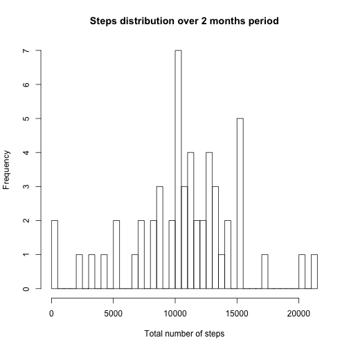
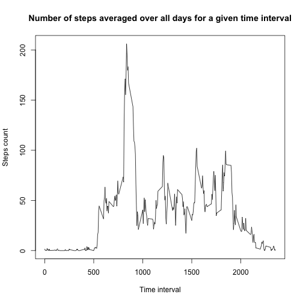
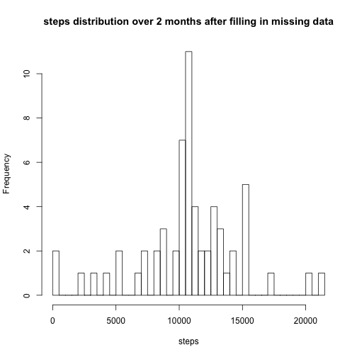
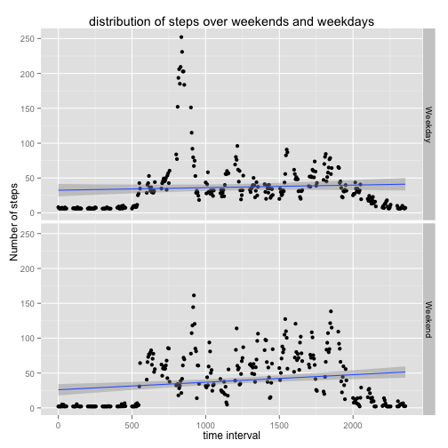

Assignment 1
===================
Detailed description        


```r
library(tidyr)
```

```
## Warning: package 'tidyr' was built under R version 3.1.1
```

```r
library(dplyr)
```

```
## Warning: package 'dplyr' was built under R version 3.1.1
```

```
## 
## Attaching package: 'dplyr'
## 
## The following object is masked from 'package:stats':
## 
##     filter
## 
## The following objects are masked from 'package:base':
## 
##     intersect, setdiff, setequal, union
```

```r
library(ggplot2)
```
##Part 1

```r
a<-read.csv("activity.csv", header = TRUE, sep = ",")

#date wise steps
b<-aggregate(a$steps,by = list(a$date), FUN = sum)

hist(b$x, breaks = 60, xlab = "Total number of steps", ylab = "Frequency", main = "Steps distribution over 2 months period")
```

 

```r
mean(b$x, na.rm = TRUE)
```

```
## [1] 10766.19
```

```r
median(b$x, na.rm = TRUE)
```

```
## [1] 10765
```
##Part 2

```r
#plot
c<-aggregate(a$steps,by = list(a$interval), FUN = mean, na.rm = TRUE)

plot(c$Group.1, c$x, type = "l", xlim = c(0,2355), xlab = "Time interval", ylab = "Steps count", main = "Number of steps averaged over all days for a given time interval")
```

 

```r
#max steps:Calculating interval having max number of averaged steps

maxvalue = max(c$x)

maxvalue
```

```
## [1] 206.1698
```

```r
c[grepl(maxvalue, c$x),1]
```

```
## [1] 835
```
##Part 3

```r
#count of rows with NA

d<-group_by(a, steps)

d<-select(d, steps, interval)

d<-summarise(d, count = n())

d[is.na(d$steps),2]
```

```
## Source: local data frame [1 x 1]
## 
##   count
## 1  2304
```

```r
#replacing NAs : Filling missing values with average number of steps across 2 months period.

a[is.na(a)]<-mean(a$steps,na.rm = TRUE)

#creating new data set with filled in missing values

f<-aggregate(a$steps,by = list(a$date), FUN = sum)

#plotting new histogram

hist(f$x, breaks = 60, xlab = "steps", main = "steps distribution over 2 months after filling in missing data")
```

 

```r
mean(f$x, na.rm = TRUE)
```

```
## [1] 10766.19
```

```r
median(f$x, na.rm = TRUE)
```

```
## [1] 10766.19
```
Yes, the frequency in histogram changes which is an expected behavior as many missing values which were earlier neglected while creating first histogram will be counted now after the missing values are replaced with average values. However, there is no significant difference in median.

##Part 4

```r
a$date<-as.Date(a$date)

a<-mutate(a, day = weekdays(date, abbreviate = TRUE), day_type = ifelse((day == "Sun" | day == "Sat"), "Weekend", "Weekday"))

g<-aggregate(a$steps,by = list(a$interval,a$day_type), FUN = mean, na.rm = TRUE)

qplot(Group.1, x, data = g, type = "l", facets = Group.2~., method = "lm", geom = c("point", "smooth"), xlab = "time interval", ylab = "Number of steps", main = "distribution of steps over weekends and weekdays")
```

 


